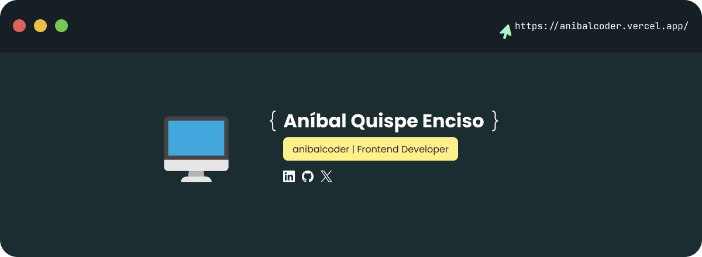

  

  <h1>¡Bienvenid@ a mi perfil de GitHub!</h1>

Autodidacta apasionado por el **desarrollo frontend**. Mi objetivo es mejorar mis habilidades y ampliar mis conocimientos para **convertirme en un excelente profesional**.

## Tecnologías 💻

## Mis Estadísticas 📊🚀

 
